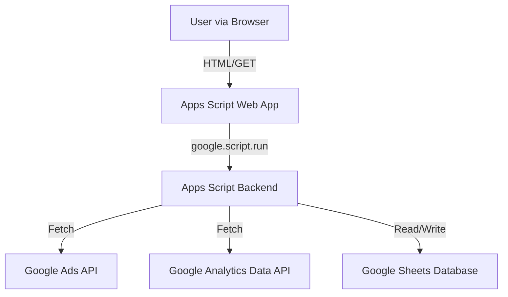

# Phase 1: Foundation (MVP) Design

## Architecture Overview

We are using a **Serverless-like architecture** hosted on Google Apps Script.

## Component Design

### 1. Backend Services (`src/`)

- **`AdsService.gs`**: Encapsulates all Google Ads specific logic. Returns normalized javascript objects.
- **`AnalyticsService.gs`**: Encapsulates GA4 logic. Handles the complex JSON request bodies required by the Data API.
- **`SheetManager.gs`**: A simplified ORM (Object-Relational Mapper) for Sheets. Handles finding sheets, appending rows, and reading ranges.
- **`Config.gs`**: Static configuration object. Segregates environment-specific IDs from logic.

### 2. Frontend Design (`src/index.html`)

- **Single Page Application (SPA)** feel, though delivered as SSR (Server Side Rendered) template initially.
- **CSS Framework**: Custom minimal CSS (CSS Variables for theming) to avoid heavy external dependencies like Bootstrap or Tailwind (unless requested later).
- **Data Loading**: Asynchronous. Page loads structure first, then calls `google.script.run` to fetch numbers. This improves perceived performance.

## Data Schema

### Sheet: `Raw_Ads_Data`

| Column       | Type   | Description               |
| ------------ | ------ | ------------------------- |
| Date         | Date   | YYYY-MM-DD                |
| CampaignId   | String | Unique ID                 |
| CampaignName | String | Human readable name       |
| Cost         | Number | Spend in account currency |
| Clicks       | Number | Count                     |
| Impressions  | Number | Count                     |
| Conversions  | Number | Count                     |

### Sheet: `Raw_GA4_Data`

| Column      | Type   | Description      |
| ----------- | ------ | ---------------- |
| Date        | Date   | YYYY-MM-DD       |
| Sessions    | Number | Count            |
| Users       | Number | Total Users      |
| Conversions | Number | Goal completions |
| BounceRate  | Number | Decimal (0-1)    |

## Implementation Strategy

- Use **Clasp** for local development.
- **Mock Data First**: Since API setup can be tricky, `AdsService` and `AnalyticsService` will support a `mock: true` flag or fallback to ensure UI development isn't blocked by API permissions.
